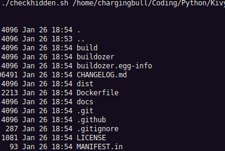
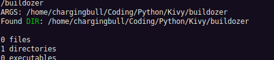

# BASH SCRIPTS FOR LINUX  
___
### These are simple BASH scripts that I have created to use on my local linux machine. Feel free to copy and or edit them to your liking.  

 

### To Run the scripts from the command line interace/shell: 
> ./scriptName

 

### Some scripts can also have arguments passed in like so:
> ./scriptName argument

 

### checkhidden.sh

 

### itemcounter.sh
